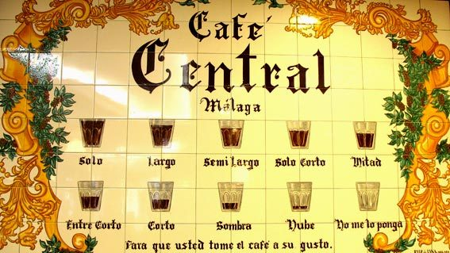

WP-CLI - Automatiza tus tareas y tómate un café
=======

Source: https://www.laopiniondemalaga.es/malaga/2015/05/06/cafe-medida-and-cafe-preparacion/763878.html

## Instalar WP-CLI
### Requisitos:

  * Entorno linux o consola Cygwin
  * PHP 5.4. Obligatorio **¡¡7.2!!**
  * WordPress >= 3.7. Obligatorio **¡¡5!!**

Descargamos:

<code>
$ curl -O https://raw.githubusercontent.com/wp-cli/builds/gh-pages/phar/wp-cli.phar  
$ php wp-cli.phar --info  

OS:	Linux 4.15.0-39-generic #42-Ubuntu SMP Tue Oct 23 15:48:01 UTC 2018 x86_64  
Shell:	/bin/bash  
PHP binary:	/usr/bin/php7.2  
PHP version:	7.2.10-0ubuntu0.18.04.1  
php.ini used:	/etc/php/7.2/cli/php.ini  
WP-CLI root dir:	phar://wp-cli.phar/vendor/wp-cli/wp-cli  
WP-CLI vendor dir:	phar://wp-cli.phar/vendor  
WP_CLI phar path:	/home/fcjurado  
WP-CLI packages dir:	  
WP-CLI global config:	  
WP-CLI project config:	  
WP-CLI version:	2.1.0  
</code>

Hay más formas de instalación (Composer, Homebrew, Docker). Revisar la documentación para más info: https://wp-cli.org/

Para ejecutarlo directamente de forma global con el comando <code>wp</code>:

<code>
$ chmod +x wp-cli.phar  
$ sudo mv wp-cli.phar /usr/local/bin/wp  
$ wp --info  

OS:	Linux 4.15.0-39-generic #42-Ubuntu SMP Tue Oct 23 15:48:01 UTC 2018 x86_64  
Shell:	/bin/bash  
PHP binary:	/usr/bin/php7.2  
PHP version:	7.2.10-0ubuntu0.18.04.1  
php.ini used:	/etc/php/7.2/cli/php.ini  
WP-CLI root dir:	phar://wp-cli.phar/vendor/wp-cli/wp-cli  
WP-CLI vendor dir:	phar://wp-cli.phar/vendor  
WP_CLI phar path:	/home/fcjurado  
WP-CLI packages dir:	  
WP-CLI global config:	  
WP-CLI project config:	  
WP-CLI version:	2.1.0  
</code>

Actualizar WP-CLI cada vez que lo vayamos a usar:

<code>$ sudo wp cli update</code>

---

## Lista de comandos

<code>https://developer.wordpress.org/cli/commands/</code>

---

## Instalar WordPress

Para ello usaremos los comandos:
 * wp config - https://developer.wordpress.org/cli/commands/config/  
 * wp db - https://developer.wordpress.org/cli/commands/db/  
 * wp core - https://developer.wordpress.org/cli/commands/core/  

<code>
$ wp core download --locale=es_ES  
$ wp config create --dbname=cafes --dbuser=fcjurado --dbpass=mysql
$ wp db create  
$ wp core install --url=wp-cli.local --title="Café Sombra" --admin_user=admin --admin_password=admin --admin_email=info@fcjurado.com  
$ wp config list  
</code>

> Whoops!! 

---

## Cambiar URL del site
<code>
$ wp option update home 'http://wp-cli.local/wp-cli/sombra/'
$ wp option update siteurl 'http://wp-cli.local/wp-cli/sombra/'
</code>

---

## Actualizar traducciones
<code>
$ wp language core update  
$ wp language plugin update --all
$ wp language theme update --all
</code>

---

## Buscar y reemplazar
<code>
$ wp search-replace "cafes.local" "cafes.com" wp_posts --dry-run --verbose  
$ wp search-replace "?utm_campaign=paid" "?utm_campaign=affiliate" wp_posts wp_postmeta --dry-run --verbose
</code>
---

## Actualizar core
Instalamos versión antigua de WP:
$ wp core download --locale=es_ES --version=4.6.1    
$ wp config create --dbname=hidromiel --dbuser=fcjurado --dbpass=mysql
$ wp db create  
$ wp core install --url=http://wpcli.local/wp-cli/hidromiel/ --title="Aguamiel" --admin_user=admin --admin_password=admin --admin_email=info@fcjurado.com  
$ wp core check-update
$ wp core update
---

## Actualizar plugins
Instalamos versión antigua de Plugin:
<code>
$ wp plugin install booking --version=8.0.1  
$ wp plugin status  
$ wp plugin update-all
</code>
---

## Actualizar temas
Instalamos versión antigua de Tema:
<code>$ wp theme install hestia --version=2.2.0
$ wp theme status
$ wp theme update-all
</code>
---

## Limpiar la caché
---

## Realizar copia de seguridad
---

## Restaurar copia de seguridad
---

## Exportar contenido
---

## Importar contenido
---

## Crear contenido
---

## Test de velocidad
---

## Optimizar base de datos
<code>wp db optimize</code>  
<code>wp db repair</code>
<code>wp db cli</code>

## WP-SEC
---

## Regenerar thumnails
1. Primero cambiamos de tema para que se vean de forma incorrecta las imágenes
2. wp media regenerate 
---

## Generar tienda y usar comandos wooCommerce
---

WP cli en remoto: https://deliciousbrains.com/wordpress-deployment-workflow-command-line/
Idea: clonar un sitio de contenido y hacer subdominios verticales

Skip-themes y skip-plugins

wp WP-SEC

https://markjaquith.wordpress.com/2018/02/12/updating-plugins-using-git-and-wp-cli/

Sólo
Largo
Semilargo
Sólo corto
Mitad
Entre corto
Corto
Sombra
Nube

Bullet list:

  * apples
  * oranges
  * pears

---

Numbered list:

  1. wash
  2. rinse
  3. repeat

## Presentación
[link](https://fcjurado.com/WPCli)  

> Tabbed.

Inline <abbr title="Hypertext Markup Language">HTML</abbr> is supported.

Text attributes _italic_, 
**bold**, `monospace`.
