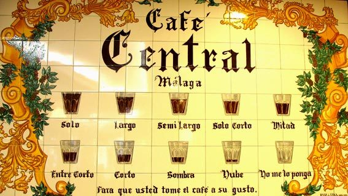

WP-CLI - Automatiza tus tareas y tómate un café
=======

Source: https://www.laopiniondemalaga.es/malaga/2015/05/06/cafe-medida-and-cafe-preparacion/763878.html

## Instalar WP-CLI
### Requisitos:

  * Entorno linux o consola Cygwin
  * PHP 5.4. Obligatorio **¡¡7.2!!**
  * WordPress >= 3.7. Obligatorio **¡¡5!!**

Descargamos:

<code>$ curl -O https://raw.githubusercontent.com/wp-cli/builds/gh-pages/phar/wp-cli.phar</code>

<code>$ php wp-cli.phar --info</code>

Hay más formas de instalación (Composer, Homebrew, Docker). Revisar la documentación para más info: https://wp-cli.org/

Para ejecutarlo directamente de forma global con el comando <code>wp</code>:

<code>$ chmod +x wp-cli.phar</code>

<code>$ sudo mv wp-cli.phar /usr/local/bin/wp</code>

<code>$ wp --info</code>

Actualizar WP-CLI cada vez que lo vayamos a usar:

<code>$ sudo wp cli update</code>

---

## Lista de comandos

<code>https://developer.wordpress.org/cli/commands/</code>

---

## Instalar WordPress

<code>$ wp core download --locale=es_ES</code>

<code>$ wp config create --dbname=cafes --dbuser=fcjurado --dbpass=mysql</code>

<code>$ wp db create</code>

<code>$ wp core install --url=wp-cli.local --title="Café Sombra" --admin_user=admin --admin_password=admin --admin_email=info@fcjurado.com</code>

<code>$ wp config list</code>

> Whoops!! 

---

## Cambiar URL del site, nombre y descripción del blog

<code>$ wp option update home 'http://wp-cli.local/wp-cli/sombra/'</code>

<code>$ wp option update siteurl 'http://wp-cli.local/wp-cli/sombra/'</code>

<code>$ wp option update blogname 'A cup of café con leche'</code>

<code>$ wp option update blogdescription 'in Plaza Mayor'</code>

---

## Actualizar traducciones

<code>$ wp language core update</code>

<code>$ wp language plugin update --all</code>

<code>$ wp language theme update --all</code>

---

## Buscar y reemplazar

<code>$ wp search-replace "cafes.local" "cafes.com" wp_posts --dry-run --verbose</code>

<code>$ wp search-replace "ipsum" "latte" wp_posts wp_postmeta --dry-run --verbose</code>

<code>$ wp search-replace "?utm_campaign=paid" "?utm_campaign=affiliate" wp_posts wp_postmeta --dry-run --verbose</code>

---

## Actualizar core

Instalamos versión antigua de WP:

<code>$ wp core download --locale=es_ES --version=4.6.1</code>

<code>$ wp config create --dbname=hidromiel --dbuser=fcjurado --dbpass=mysql</code>

<code>$ wp db create</code>

<code>$ wp core install --url=http://wpcli.local/wp-cli/hidromiel/ --title="Hidromiel" --admin_user=admin --admin_password=admin --admin_email=info@fcjurado.com</code>

<code>$ wp core check-update</code>

<code>$ wp core update</code>

---

## Desactualizar core

<code>$ wp core download --force --version=4.5</code>

<code>$ wp core update --version=4.5 --force</code>

---

## Instalar tema

<code>$ wp theme install coffeeisle --activate </code>

<code>$ wp theme install fury --activate</code>

---

## Instalar plugin

<code>$ wp plugin install coffee-cup-widget --activate</code>

<code>$ wp plugin install coffee-cup-widget --activate</code>

<code>$ wp plugin install contact-form-7 jetpack wordpress-seo user-registration google-sitemap-generator w3-total-cache vaultpress wp-smushit wp-optimize google-analytics-for-wordpress all-in-one-schemaorg-rich-snippets bj-lazy-load wordfence broken-link-checker social-icons cornify-for-wordpress hello-darth food-and-drink-menu tlp-food-menu tinycoffee --activate</code>

---

## Instalar plugin con widget y agregar widget

<code>$ wp plugin install coffee-cup-widget</code>

<code>$ wp sidebar list</code>

<code>$ wp option list | grep widget_ </code>

<code>$ wp widget add coffeecup fury-sidebar 1 --title="Select Coffee"</code>

---

## Actualizar plugins

Instalamos versión antigua de Plugin:

<code>$ wp plugin install booking --version=8.0.1</code>

<code>$ wp plugin status</code>

<code>$ wp plugin update-all</code>

---

## Actualizar temas
Instalamos versión antigua de Tema:

<code>$ wp theme install hestia --version=2.2.0</code>

<code>$ wp theme status</code>

<code>$ wp theme update-all</code>

---

## Crear contenido random

<code>$ wp term generate category --count=100</code>

<code>$ wp term generate post_tag --count=100</code>

<code>$ wp post generate --count=1000</code>

<code>$ wp post generate --count=100 --post_type=page</code>

<code>$ wp user generate --count=100</code>

<code>$ wp post generate --format=ids --count=100 | xargs -0 -d ' ' -I % wp comment generate --count=10 --post_id=%</code>

<code>$ curl "https://baconipsum.com/api/?type=meat-and-filler&paras=10&format=html" | wp post generate --count=5 --post_content --format=ids | xargs -0 -d ' ' -I % wp comment generate --count=10 --post_id=%</code>

---

## Importar usuarios desde CSV

$ wp user import-csv

---

## Limpiar la caché

<code>$ wp transient delete --expired</code>

<code>$ wp cache flush</code>

---

## Exportar contenido

---

## Importar contenido

---

## Realizar copia de seguridad BD

<code>$ wp db export ~/cafes.sql</code>

---

## Restaurar copia de seguridad BD

<code>$ wp db import ~/cafes.sql</code>

---

## Crear staging site 

Recomendado al hacer acciones automáticas de actualizaciones

<code>$ mkdir staging </code>

<code>$ cd staging</code>

<code>$ cp -R ../sombra/* ./ </code>

<code>$ wp config set DB_NAME staging</code>

<code>$ wp db create</code>

<code>$ wp db import ~/cafes.sql</code>

<code>$ wp search-replace 'http://wpcli.local/wp-cli/cafes/' 'http://wpcli.local/wp-cli/staging/' </code>

<code>$ wp option update home 'http://wp-cli.local/wp-cli/staging/'</code>

<code>$ wp option update siteurl 'http://wp-cli.local/wp-cli/staging/'</code>

---

## Optimizar base de datos

<code>$ wp db optimize</code>

<code>$ wp db repair</code>

<code>$ wp db size</code>

---

## BSOD - Panic mode ON

<code>$ wp plugin deactivate --all</code>

<code>$ wp theme activate twentynineteen </code>

<code>$ wp core update -–version=4.6.1 –-force </code>

<code>$ wp plugin activate <plugins></code>

---

## Consola MySQL

<code>$ wp db cli</code>

---

## Subir imágenes desde local

<code>$ wp media import ../images/*.jpg </code>

<code>wp media import ../images/DSC_4321.png --post_id=1 \
--title="A little cat" --featured_image</code>

---

## Regenerar thumnails

Cambiamos el tema para necesitar regenerar

<code>$ wp theme install coffeecafe --activate </code>

<code>$ wp media regenerate --yes </code>

---

## Extensiones

<code>$ wp package list </code>

<code>$ wp package install _package_ </code>

---

### Renombrar prefijo de la base de datos

<code>$ wp package install iandunn/wp-cli-rename-db-prefix</code>

<code>$ wp rename-db-prefix cafe_solo_</code>

---

### WP-SEC

WP-SEC es una extensión que realiza chequeo de vulnerabilidades con wpvulndb.com
<code>
$ wp package install markri/wp-sec

$ wp wp-sec check
</code>

---